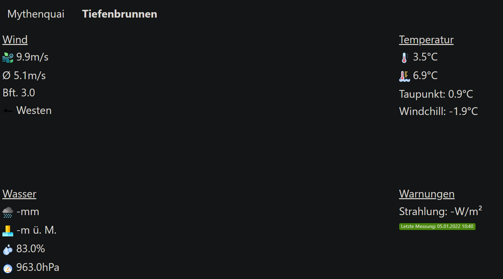
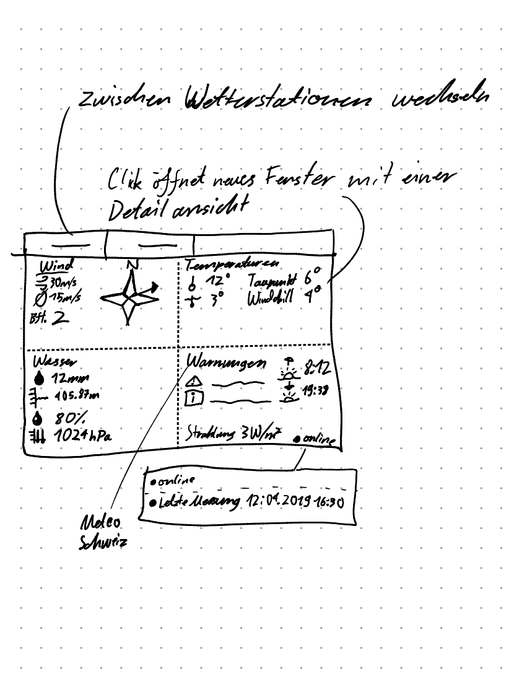
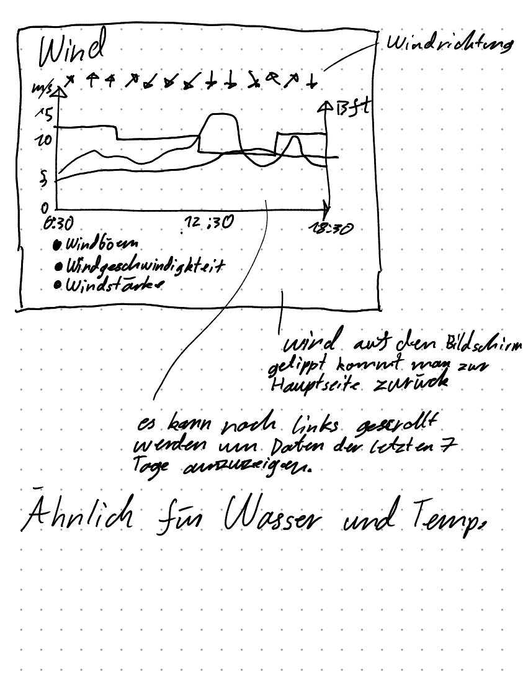
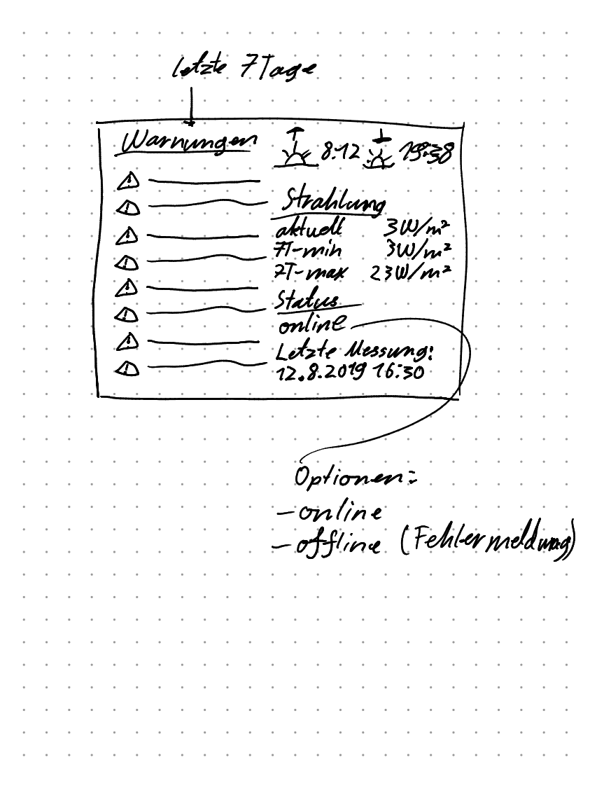

# Log anzeigen
```bash
journalctl -u kiosk.service -f
```

# Configs ändern bei Service adressen
Folgende Zeile ändern in der weather_app/config.ini

[Service]
URL = Servicename des Wetterdienstes

# Configs änderen bei der Datenbank für Produktion
Folgende Zeilen ändern in der weather_app/config.ini

[Database]
DB_Host = Ihr Hostname
username = Datenbankusername
password = Datenbankpasswort!! nicht im cleartext sondern als env variable 
DB_PORT = Ihr Datenbank port 
DB_Name = Datenbankname


# Run development Server
```bash
python3 main.py --config=config.ini
```


 # Hinzufügen weiterer Wetterdaten-Quellen
 - falls jetziger service genutzt wird:
    - unter weatherdata.py -> class Config -> stations -> weiterer stationsName hinzufügen
    - unter templates/index.html -> auf Zeile 20 -> <li><a href="/wetterstation/neuer_stations_name" class={{ "text-bold" if station == "neuer_stations_name" }}>neuer_stations_name</a></li>


# Projekt Struktur
📦FHNW_Wettermonitor 
 ┣ 📂Messwerte                                                # CSV Template Files
 ┃ ┣ 📜messwerte_mythenquai_2007-2020.csv                     # Mythenquai Messwerte
 ┃ ┗ 📜messwerte_tiefenbrunnen_2007-2020.csv                  # Tiefenbrunnen Messwerte
 ┣ 📂weather_app
 ┃ ┣ 📂static                                                 # Static Files
 ┃ ┃ ┣ 📂Images                                               # Static Images
 ┃ ┃ ┃ ┣ 📂graphs
 ┃ ┃ ┃ ┣ 📂weather                                            # Static Weather Images für Website
 ┃ ┃ ┃ ┃ ┣ 📜arrow.png
 ┃ ┃ ┃ ┃ ┣ 📜barometer.png
 ┃ ┃ ┃ ┃ ┣ 📜humidity.png
 ┃ ┃ ┃ ┃ ┣ 📜rain.png
 ┃ ┃ ┃ ┃ ┣ 📜sea-level.png
 ┃ ┃ ┃ ┃ ┣ 📜temperature.png
 ┃ ┃ ┃ ┃ ┣ 📜water-drop.png
 ┃ ┃ ┃ ┃ ┣ 📜water-temperature.png
 ┃ ┃ ┃ ┃ ┗ 📜windy.png
 ┃ ┃ ┃ ┣ 📜generating_plot.png
 ┃ ┃ ┃ ┗ 📜loading.png
 ┃ ┃ ┣ 📜jquery-3.4.1.min.js
 ┃ ┃ ┣ 📜metro-all.min.css                                      # Metro UI CSS
 ┃ ┃ ┣ 📜metro.min.js                                           # Metro UI JS
 ┃ ┃ ┣ 📜scripts.js
 ┃ ┃ ┣ 📜stop_server.js                                         # Script zum stoppen des Javascript Web Servers 
 ┃ ┃ ┗ 📜styles.css                                             # Stylesheet für die Website
 ┃ ┣ 📂templates                                                # View Schicht Templates für die Website ref(https://flask.palletsprojects.com/en/2.0.x/tutorial/templates/)
 ┃ ┃ ┣ 📜graph.html                                             # Template für die Graphs
 ┃ ┃ ┣ 📜index.html                                             # Template für die Startseite Navigationsleiste und imports der anderen Seiten
 ┃ ┃ ┣ 📜load_data.html                                         # Template für die Daten laden auch splash screen gennant
 ┃ ┃ ┗ 📜main.html                                              # Daarstellungs Template für die Startseite
 ┃ ┣ 📜config.ini                                               # Config für die Datenbank & Webservice Url / Endpoints
 ┃ ┣ 📜getEntries.py
 ┃ ┣ 📜Logger.py
 ┃ ┣ 📜main.py                                                   # Webservice Instanziierung und zentraler Controller
 ┃ ┣ 📜requirements.txt                                          # pip install -r requirements.txt 
 ┃ ┣ 📜test_sean.ipynb
 ┃ ┣ 📜weatherdata.py                                            # Helper Klasse für Controller
 ┃ ┣ 📜weatherimport.py                                          # Controller & Modell Schicht mit allen Funktionalitäten
 ┃ ┣ 📜wettermonitor.log
 ┣ 📜DEVELOPMENT.md
 ┣ 📜diagram.png
 ┣ 📜install.sh
 ┣ 📜INSTALLATION.md
 ┣ 📜kiosk.service
 ┣ 📜kiosk.sh
 ┣ 📜Powerpoint.pptx
 ┣ 📜README.md
 ┣ 📜response_time.txt                                          


# Künftiges Ui und Upcoming Features
## Dark Mode und andere Themes


## Zukünftiges Design


## Detailansicht Wind, Temperaturen und Wasser


## Detailansicht Warnungen und Diverses



## Roadmap
  - User Feedback implementieren
  - Satelliten Bilder für Graphs
  - Alerts per SMS und Email für geplante Sportaktivitäten
  - Docker integration mit Docker File und Docker Compose 
  - Performance Optimierungen
  - Sonnenaufgang und Sonnenuntergang anzeigen
  - Warnungen von Swissmeteo darstellen
  - Wettermonitor nicht im Userverzeichnis installieren
  - Flaskwebgui ersetzten mit electron-flask production ready

