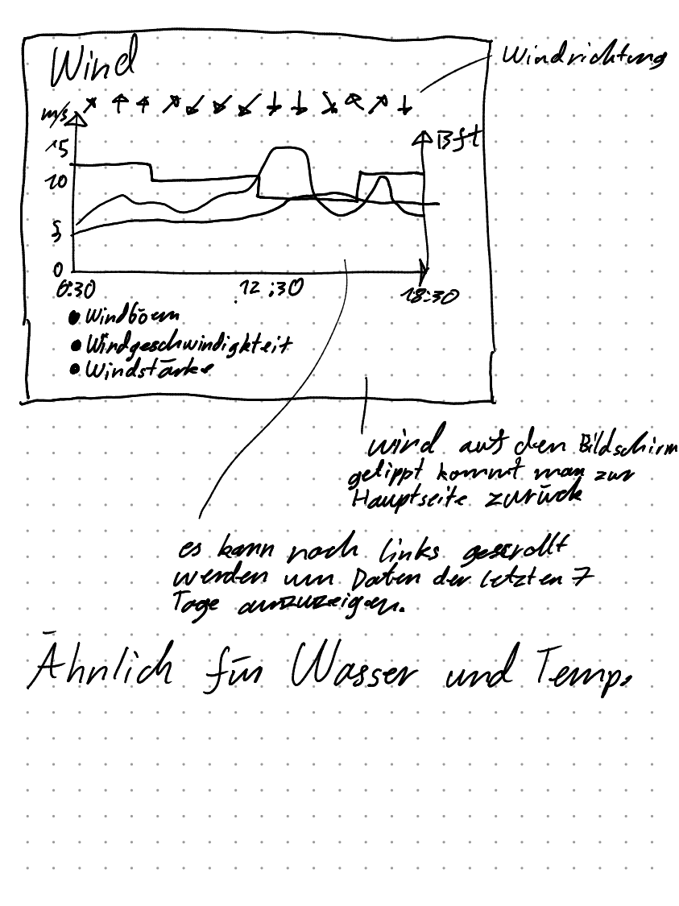

# FHNW_Wettermonitor

# Installation
Siehe [INSTALLATION.md](INSTALLATION.md)

# Entwickeln
```
pip install -r weather_app/requirements.txt
```

# Betrieb
TODO:
 - Bedienungsanleitung
 - Wo Log ansehen?
 - Wie service starten/stoppen?

# Zukünftiges Design


## Detailansicht Wind, Temperaturen und Wasser


## Detailansicht Warnungen und Diverses


## weitere Features
 - Sonnenaufgang und Sonnenuntergang anzeigen
 - Warnungen von Swissmeteo darstellen
 - Wettermonitor nicht im Userverzeichnis installieren
 - Production ready Webserver für Flask verwenden

# Analyse tecdottir-API
Die Frage ist, publiziert die tecdottir-API die Daten immer pünktlich zu den vollen 10 Minuten?

Zur Beantwortung dieser Frage haben wir ein Script geschrieben welches jede Sekunde überprüft, ob neue Daten publiziert wurden.
```python
import requests
from datetime import datetime, timedelta
import json
import time

length_tiefenbrunnen = 0
length_mythenquai = 0
while True:
    # tiefenbrunnen
    current_time = datetime.now()
    current_day = current_time.replace(hour = 0, minute = 0, second = 0, microsecond = 0)
    response = requests.get(f"https://tecdottir.herokuapp.com/measurements/tiefenbrunnen?startDate={current_day.strftime('%Y-%m-%d')}&endDate={current_day.strftime('%Y-%m-%d')}")
    if response.ok:
        jData = json.loads(response.content)
        results = jData["result"]
        if length_tiefenbrunnen != len(results):
            length_tiefenbrunnen = len(results)
            print("tiefenbrunnen " + str(current_time) + " " + str(length_tiefenbrunnen) + " " + results[length_tiefenbrunnen-1]["timestamp"])
    # mythenquai
    current_time = datetime.now()
    current_day = current_time.replace(hour = 0, minute = 0, second = 0, microsecond = 0)
    response = requests.get(f"https://tecdottir.herokuapp.com/measurements/mythenquai?startDate={current_day.strftime('%Y-%m-%d')}&endDate={current_day.strftime('%Y-%m-%d')}")
    if response.ok:
        jData = json.loads(response.content)
        results = jData["result"]
        if length_mythenquai != len(results):
            length_mythenquai = len(results)
            print("mythenquai    " + str(current_time) + " " + str(length_mythenquai) + " " + results[length_mythenquai-1]["timestamp"])
    # no DOS attacks from FHNW
    time.sleep(1)
```
Wir haben das Script 21 Stunden laufen lasse (Resultat [hier](response_time.txt))

Wir sind zum folgendem Schluss gekommen:
 - Die Daten werden ein paar Sekunden nach 05' 15' 25' ... veröffentlicht
 - Die paar Sekunden waren nie mehr als 6.6s
 - Es macht also Sinn jeweils um xx:05:10 xx:15:10 xx:25:10 ... die API anzufragen.
 - Pareto-Diagramm: 